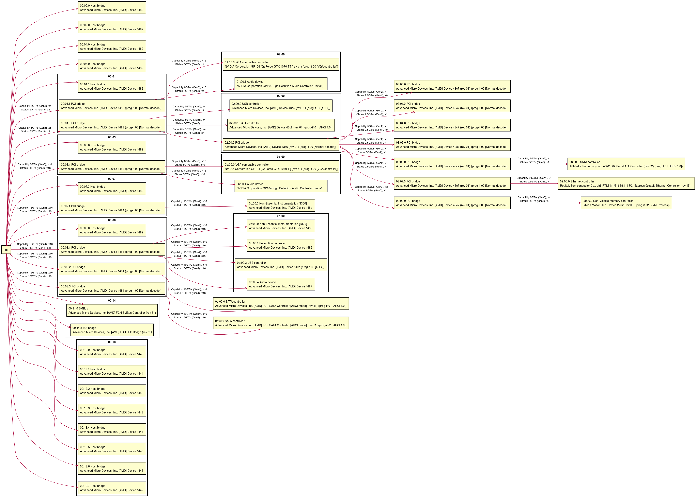

# pcimap

This tool visualizes which PCIe expansion cards are connected and at what speed they are running.

## Usage
```
./run.sh
```
`run.sh` outputs `out.md`

[Markdown Preview Enhanced](https://github.com/shd101wyy/markdown-preview-enhanced) can convert `out.md` to svg, png etc.

## Example output

